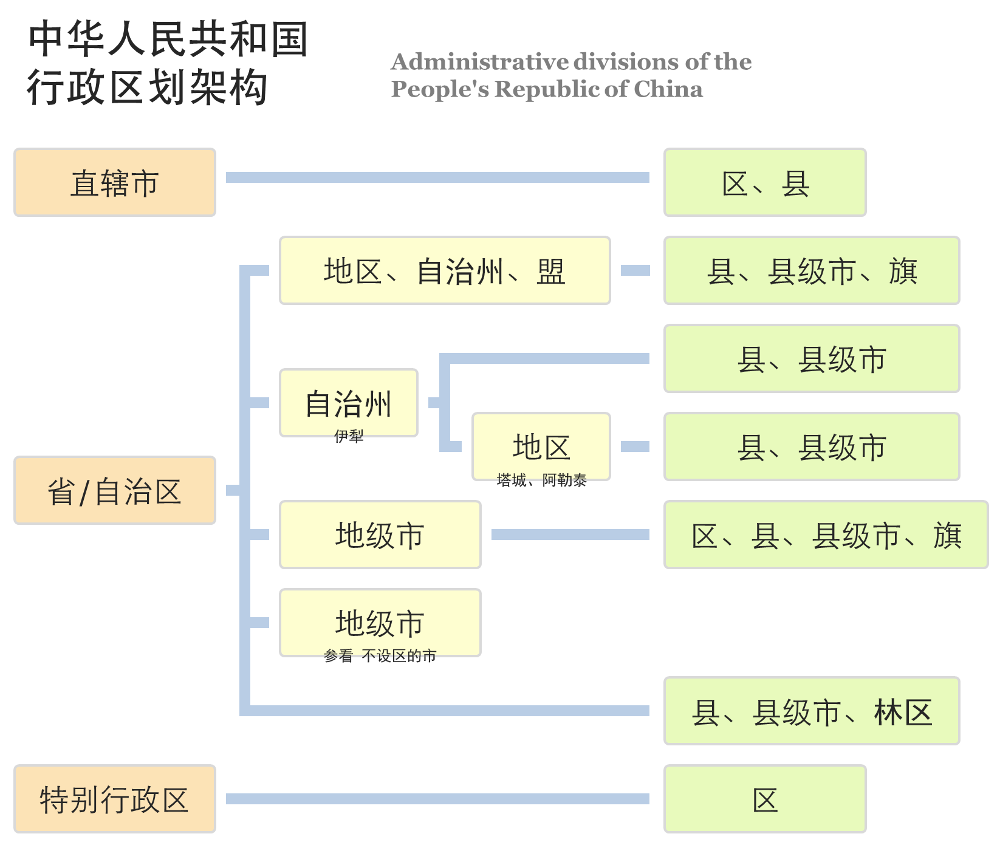

# china-administrative-division - 中华人民共和国行政区划代码（县及县以上）

## 现状简介
截至2017年6月底，中华人民共和国各级行政区划统计数量如下：

- [省级行政区**34**个](https://zh.wikipedia.org/wiki/%E4%B8%AD%E5%9B%BD%E4%B8%80%E7%BA%A7%E8%A1%8C%E6%94%BF%E5%8C%BA)，其中包括：[**4**个直辖市](https://zh.wikipedia.org/wiki/%E7%9B%B4%E8%BE%96%E5%B8%82)，[**23**个省](https://zh.wikipedia.org/wiki/%E7%9C%81_(%E8%A1%8C%E6%94%BF%E5%8D%80%E5%8A%83))，[**5**个自治区](https://zh.wikipedia.org/wiki/%E8%87%AA%E6%B2%BB%E5%8C%BA)，[**2**个特别行政区](https://zh.wikipedia.org/wiki/%E7%89%B9%E5%88%AB%E8%A1%8C%E6%94%BF%E5%8C%BA)
- [地级行政区**334**个](https://zh.wikipedia.org/wiki/%E5%9C%B0%E7%BA%A7%E8%A1%8C%E6%94%BF%E5%8C%BA)
- [县级行政区**2851**个](https://zh.wikipedia.org/wiki/%E5%8E%BF%E7%BA%A7%E8%A1%8C%E6%94%BF%E5%8C%BA)

各级层次架构，可以用以下图来概括：

## 编码规则
> 具体可以参考[《民政统计代码编制规则》](http://www.mca.gov.cn/article/sj/tjbz/a/201507/20150700854848.shtml)

《中华人民共和国行政区划代码》国家标准中定义县及县以上使用6位数字标识，代码从左至右的含义是：
- 第一、二位表示省级行政单位（省、自治区、直辖市、特别行政区），其中第一位代表[大区](https://zh.wikipedia.org/wiki/Category:%E4%B8%AD%E5%8D%8E%E4%BA%BA%E6%B0%91%E5%85%B1%E5%92%8C%E5%9B%BD%E8%A1%8C%E6%94%BF%E5%8C%BA%E5%88%92%E4%BB%A3%E7%A0%81)；
- 第三、四位表示地级行政单位（地级市、地区、自治州、盟及省级单位直属县级单位的汇总码）；
- 第五、六位表示县级行政单位（县、自治县、市辖区、县级市、旗、自治旗、林区、特区）；

另外，《民政统计代码编制规则》中定义了12位的编码，分为3段，用于统计到最基层的居委会，具体规则如下：
- 第一段为**6位数字**，表示县及县以上的行政区划，使用《中华人民共和国行政区划代码》国家标准；
- 第二段为**3位数字**，按照国家标准《县以下行政区划代码编制规则》编制，其规则如下：
  - 第二段的第一位数字为类别标识，以“0”表示街道，“1”表示镇，“2和3”表示乡，“4和5”表示政企合一的单位；
  - 第二段的第二位、第三位数字为该代码段中各行政区划的顺序号；
- 第三段**3位数字**，标识居民委员会和村民委员会的代码

## 参考链接
- [民政部 - 中华人民共和国行政区划代码](http://www.mca.gov.cn/article/sj/tjbz/a/)
- [维基百科 - 中华人民共和国行政区划](https://zh.wikipedia.org/wiki/%E4%B8%AD%E5%8D%8E%E4%BA%BA%E6%B0%91%E5%85%B1%E5%92%8C%E5%9B%BD%E8%A1%8C%E6%94%BF%E5%8C%BA%E5%88%92)
- [维基百科 - 中华人民共和国行政区划代码](https://zh.wikipedia.org/wiki/%E4%B8%AD%E5%8D%8E%E4%BA%BA%E6%B0%91%E5%85%B1%E5%92%8C%E5%9B%BD%E8%A1%8C%E6%94%BF%E5%8C%BA%E5%88%92%E4%BB%A3%E7%A0%81)
- [民政统计代码编制规则](http://www.mca.gov.cn/article/sj/tjbz/a/201507/20150700854848.shtml)

## License

Copyright © 2017-present. This source code is licensed under the MIT license found in the
[LICENSE](./LICENSE) file.

---
Made by Tony ([blog](https://itony.net))
